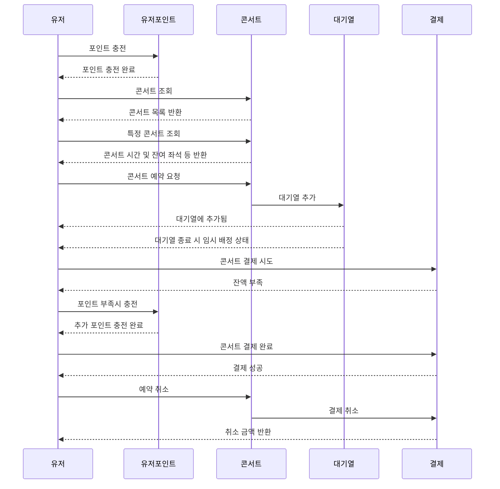

# 콘서트 예약 프로그램

## 목차

- [일정](#일정-milestone)
- [요구사항 분석](#요구사항-분석)
- [프로젝트 구조](#프로젝트-구조)
- [ERD](#ERD)
- [API 명세](#API-명세)

### 일정 (Milestone)

#### M3 (3주차)

- [x] 요구사항 분석 및 아키텍쳐 설계
- [x] 플로우 차트 그리기
- [ ] ERD 설계
- [ ] API 명세 작성
- [ ] MockAPI 구현

#### M4 (4주차)

- [ ] 엔티티 구현 및 기본적인 조회/저장 구현
	- 유저 포인트 충전/사용, 콘서트 및 콘서트별 일자, 잔여 좌석 등 조회
- [ ] 토큰 기반 대기열 처리 구현 및 Polling
- [ ] 임시 배정 및 잔여석 표시 구현 및 테스트

#### M5 (5주차)

- [ ] 콘서트 결제 기능 구현 (동시성 처리)
	- [ ] 사용자 포인트에 대한 예외 처리 포함
	- [ ] 임시 배정 상태 등 데이터 정합성 처리 포함
- [ ] E2E 테스트 및 예외처리

---

### 요구사항 분석

> #### 1. 콘서트 조회
>> - 콘서트 목록 조회
>> - 각 콘서트의 예약 가능 날짜 조회
>> - 각 날짜별 좌석 조회 (좌석의 정보는 1~50번 총 50개로 제한)
>
> #### 2. 콘서트 예매 시 대기열
>> - 콘서트 예매 요청 시 결재 대기열을 **토큰을 이용해** 생성
>> - 토큰을 활용하며 해당 토큰에는 ```유저정보```,```대기순서```,```잔여시간``` 정보들이 포함
>> - ```HTTP Polling``` 으로 처리되며 ```대기순서``` 및 ```잔여시간```은 매번 새로 갱신
>> - 결제 대기열 이후 **좌석 예약 및 결제** 가능
>> - 결제 이후 당일 기간 전에 취소 가능
>
> #### 3. 좌석 예약 및 결제
>> - 5분 동안만 **임시배정 상태**로 해당 데이터를 저장
>> - 5분이 지나도 임시배정 상태라면 데이터 삭제
>
> #### 4. 포인트 충전, 조회 및 사용
>> - 각 유저별 포인트 충전 및 조회 가능 (**임시배정 상태** 에서도 가능)
>> - 임시배정 상태의 요청에 대해서만 포인트 사용이 가능
>> - 포인트 사용 후 해당 유저가 **좌석 소유**

#### 플로우차트



---

### 프로젝트 구조

#### 기본 패키지 구조
```
/presentation
  /user
  /concert
  /payment
/application
  /payment
  /reservation
/domain
  /user
  /concert
  /payment
/infrastructure
  /user
  /concert
  /payment
```

---

### ERD

### API 명세