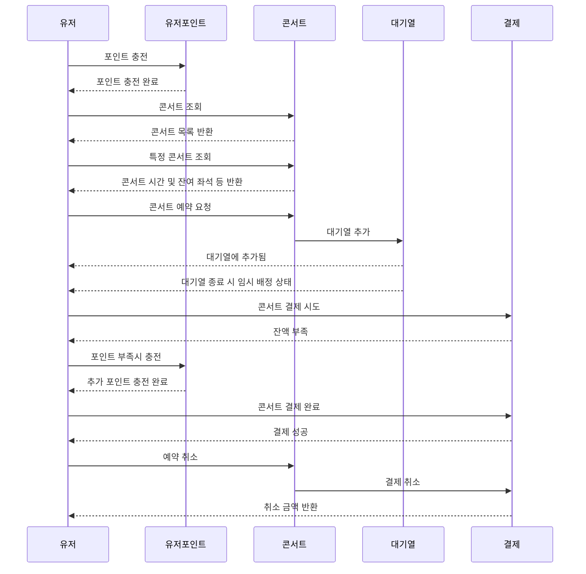
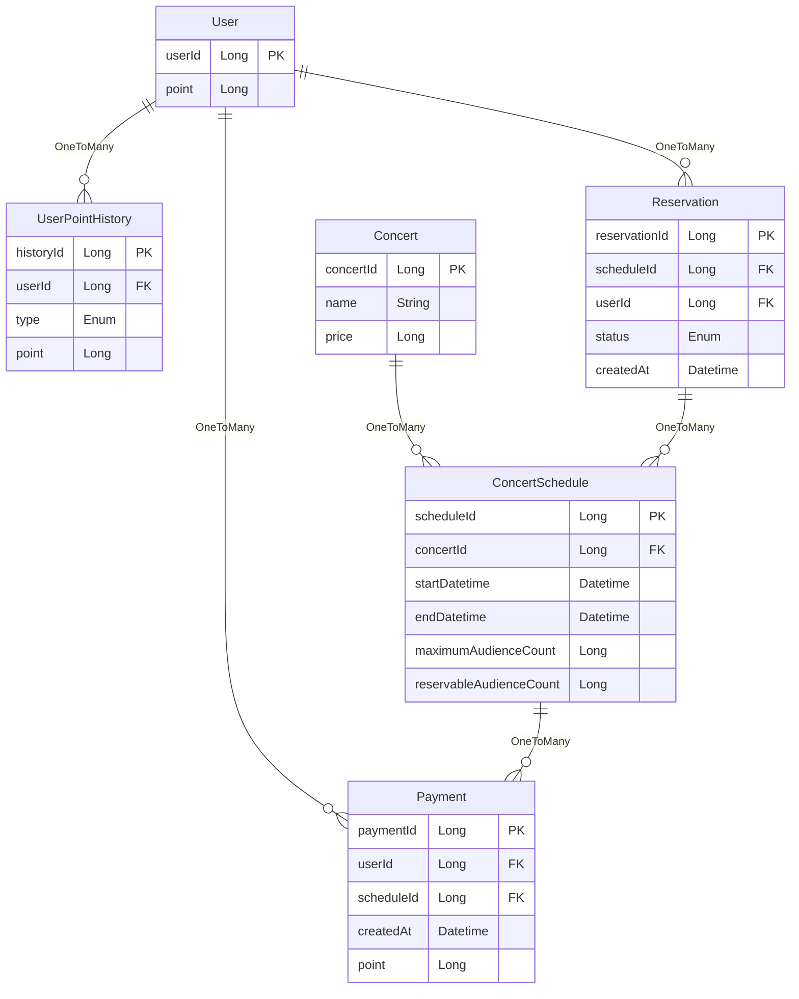

# 콘서트 예약 프로그램

## 목차

- [일정](#일정-Milestone)
- [요구사항 분석](#요구사항-분석)
- [프로젝트 구조](#프로젝트-구조)
- [ERD](#ERD)
- [API 명세](#API-명세)

### 일정 (Milestone)

#### M3 (3주차)

- [x] 요구사항 분석 및 아키텍쳐 설계
- [x] 플로우 차트 그리기
- [x] ERD 설계
- [x] API 명세 작성
- [ ] MockAPI 구현

#### M4 (4주차)

- [ ] 엔티티 구현 및 기본적인 조회/저장 구현
  - 유저 포인트 충전/사용, 콘서트 및 콘서트별 일자, 잔여 좌석 등 조회
- [ ] 토큰 기반 대기열 처리 구현 및 Polling
- [ ] 임시 배정 및 잔여석 표시 구현 및 테스트

#### M5 (5주차)

- [ ] 콘서트 결제 기능 구현 (동시성 처리)
  - [ ] 사용자 포인트에 대한 예외 처리 포함
  - [ ] 임시 배정 상태 등 데이터 정합성 처리 포함
- [ ] E2E 테스트 및 예외처리

---

### 요구사항 분석

> #### 1. 콘서트 조회
>
> > - 콘서트 목록 조회
> > - 각 콘서트의 예약 가능 날짜 조회
> > - 각 날짜별 좌석 조회 (좌석의 정보는 1~50번 총 50개로 제한)
>
> #### 2. 콘서트 예매 시 대기열
>
> > - 콘서트 예매 요청 시 결재 대기열을 **토큰을 이용해** 생성
> > - 토큰을 활용하며 해당 토큰에는 `유저정보`,`대기순서`,`잔여시간` 정보들이 포함
> > - `HTTP Polling` 으로 처리되며 `대기순서` 및 `잔여시간`은 매번 새로 갱신
> > - 결제 대기열 이후 **좌석 예약 및 결제** 가능
> > - 결제 이후 당일 기간 전에 취소 가능
>
> #### 3. 좌석 예약 및 결제
>
> > - 5분 동안만 **임시배정 상태**로 해당 데이터를 저장
> > - 5분이 지나도 임시배정 상태라면 데이터 삭제
>
> #### 4. 포인트 충전, 조회 및 사용
>
> > - 각 유저별 포인트 충전 및 조회 가능 (**임시배정 상태** 에서도 가능)
> > - 임시배정 상태의 요청에 대해서만 포인트 사용이 가능
> > - 포인트 사용 후 해당 유저가 **좌석 소유**

#### 플로우차트



---

### 프로젝트 구조

```
/presentation
  /user
  /concert
  /payment
/application
  /payment
  /reservation
/domain
  /user
  /concert
  /payment
/infrastructure
  /user
  /concert
  /payment
```

- `presentation` : 클라이언트의 요청/응답 레이어
- `application` : 비즈니스 로직을 담당하는 레이어
- `domain` : 엔티티, 인터페이스 등의 도메인의 로직 레이어
- `infrastructure` : 외부 시스템(e.g. 데이터베이스)과의 상호작용을 처리하는 레이어

---

### ERD



---

### API 명세

- `500` : 공통적으로 처리할 수 없는 오류입니다.
  ```json
  { "error" : "알 수 없는 오류입니다." }
  ```

#### 유저 포인트

- **GET** `/users/{userId}/points` : 포인트를 조회합니다.
  - Response Body
    - `200`
      ```json
      { "point": 20000 }
      ```
    - `404`
      ```json  
      { "error": "유저를 찾을 수 없습니다." }
      ```

- **GET** `/users/{userId}/points/histories` : 유저의 포인트 사용이력을 조회합니다.
  - Response Body
    - `200`
      ```json
      [
        {
          "historyId": 1,
          "type" : "CHARGE",
          "point" : 25000
        },
        {
          "historyId": 2,
          "type" : "USE",
          "point" : 10000
        }
      ]
      ```
    - `404`
      ```json  
      { "error": "유저를 찾을 수 없습니다." }
      ```

- **PATCH** `/users/{userId}/points/charge` : 포인트를 충전합니다.
  - Request Body
    ```json
    { "point": 10000 }
    ```
  - Response Body
    - `200` : 충전 이후 현재 보유 포인트를 반환합니다.
      ```json
      { "point" : 10000 }
      ```
    - `404`
      ```json  
      { "error": "유저를 찾을 수 없습니다." }
      ```

#### 콘서트

- **GET** `/concerts` : 콘서트 목록을 조회합니다.
  - Response Body
    - `200`
      ```json
      [
        {
          "concertId": 1,
          "name": "허재의 카드마술쇼",
          "price": 70000
        },
        {
          "concertId": 2,
          "name": "하헌우의 라이브 코딩쇼",
          "price": 70000
        }
      ]
      ```

- **GET** `/concerts/{concertId}/schedules` : 콘서트의 일정을 조회합니다.
  - Response Body
    - `200`
      ```json
      [
        {  
          "scheduleId": 1,
          "startDatetime": "2024-10-31 14:30:00",
          "endDatetime": "2024-10-31 15:30:00",
          "maximumAudienceCount" : 50,
          "reservableAudienceCount" : 1
        },
        {
          "scheduleId": 2,
          "startDatetime": "2024-11-31 14:30:00",
          "endDatetime": "2024-11-31 15:30:00",
          "maximumAudienceCount" : 50,
          "reservableAudienceCount" : 0
        }
      ]
      ```
    - `404`
      ```json
      { "error" : "콘서트를 찾을 수 없습니다." }
      ```

- **PUT** `/concerts/{concertId}/schedules/{scheduleId}/reserves` : 콘서트를 예약합니다.
  - Response Body
    - `201` : 대기열 토큰을 반환합니다.
    ```json
    { "token" : "ey..." }
    ```
    - `406`
    ```json
    { "error" : "매진된 일자 입니다." }
    ```

- **GET (Polling)** `/concerts/{concertId}/schedules/{scheduleId}/reserves` : 대기 상태를 조회합니다.
  - Request Header
    ```json
    { "Authorization" : "ey..." }
    ```
  - Response Body
    - `200` : 대기열 이후, 5분간 유효한 결제 토큰을 반환합니다.
    ```json
    { "token" : "ey..." }
    ```
    - `202` : 콘서트 정보와 남은 대기열 수를 반환합니다.
    ```json
    {
      "concertId": 1,
      "name": "허재의 카드마술쇼",
      "price": 70000,
      "maximumAudienceCount" : 50,
      "waitingQueueLength": 2
    }
    ```
    - `401` : 대기열 토큰이 올바르지 않거나 누락된 경우입니다.
    ```json
    { "error" : "올바르지 않은 요청입니다." }
    ```

#### 결제

- **POST** `/payments` : 결제를 요청합니다.
  - Request Header
    ```json
    { "Authorization" : "ey..." }
    ```
  - Response Body
    - `200`
      ```json
      {
        "paymentId": 1,
        "concertId" : 1,
        "point" : 70000,
        "startDatetime": "2024-10-31 14:30:00",
        "endDatetime": "2024-10-31 15:30:00"
      }
      ```
    - `406`
      ```json
      { "error" : "포인트가 부족합니다. 충전 후 다시 시도해주세요" }
      ```
    - `408`
      ```json
      { "error" : "요청 시간이 초과되었습니다." }
      ```

- **GET** `/payments/users/{userId}/histories` : 결제 이력을 조회합니다.
  - Response Body
    - `200`
      ```json
      [
        {
          "paymentId": 1,
          "concertId": 1,
          "scheduleId": 1, 
          "type": "CHARGE",
          "createdAt": "2024-10-10 14:30:00",
          "point": 50000
        },
        {
          "paymentId": 2,
          "concertId": 2,
          "scheduleId": 1,
          "type": "USE",
          "createdAt": "2024-11-10 14:30:00",
          "point": 25000
        }
      ]
      ```

- **DELETE** `/payments/users/{userId}/histories/{paymentId}`
  - Response Body
    - `204` : 결제가 성공적으로 취소되었습니다.
    - `404`
      ```json
      { "error" :  "해당 결재내역을 찾을 수 없습니다." }
      ```