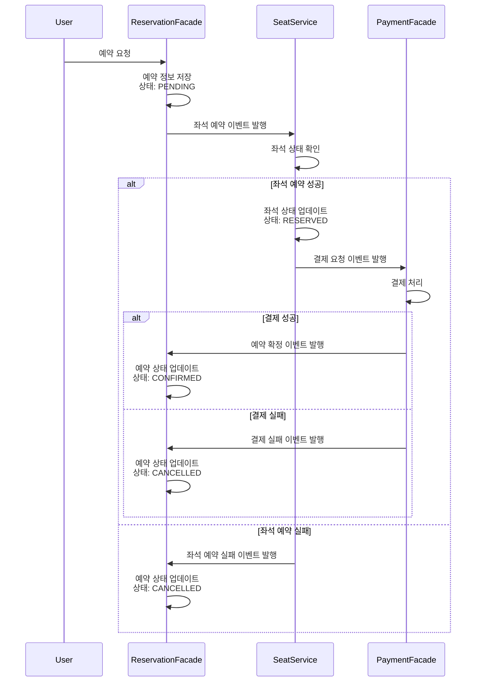

# 현재 시스템의 트랜잭션

> 차주의 이벤트 기반 아키텍쳐를 위한 개선 방향에 대한 설계

```좌석 예약 -> 결재 대기```, ```좌석 선점 -> 결제``` 까지 각각 현재 하나의 트랜잭션으로 처리중이며  
이에 따라 데이터베이스에 잦은 요청이 생기고 DB수준의 락이 발생하기 쉬운 구조
또한 장애전파가 될 가능성이 높음

# 서비스 분리 방식

> 도메인의 부하를 분산하여 시스템 전체의 성능을 개선하고  
> 독립적인 확장 및 배포가 가능하도록 개선 ..

## 고려해야 할 점

### 2PC(Two-Phase Commit):

- 여러 서비스의 데이터베이스를 동시에 트랜잭션으로 묶기 위해 사용
- 단점: 복잡성 증가, 성능 저하, 네트워크 지연 및 장애에 취약

### 데이터 일관성

시나리오

- 예약 서비스에서 좌석 예약이 완료되었지만, 결제 서비스에서 결제가 실패한 경우
- 좌석 서비스에서 좌석 상태가 업데이트되었지만, 예약 서비스에서 예약 정보가 반영되지 않은 경우

## 이벤트 기반 처리 순서

### 1. Reservation Facade

- 사용자로부터 예약 요청을 받으면 좌석 예약 이벤트를 발행
- 예약 정보를 데이터베이스에 저장

### 2. Seat Service

- 좌석 예약 이벤트를 수신하여 좌석 상태를 업데이트
- 좌석 업데이트 성공 시 결제 요청 이벤트를 발행
- 실패 시 좌석 예약 실패 이벤트를 발행

### 3. Payment Facade

- 결제 요청 이벤트를 수신하여 결제 처리
- 결제 성공 시 예약 확정 이벤트를 발행
- 결제 실패 시 결제 실패 이벤트를 발행

### 4. Reservation Facade

- 예약 확정 이벤트를 수신하여 예약 상태를 업데이트
- 결제 실패 또는 좌석 예약 실패 이벤트를 수신하여 예약 취소 처리

## 다이어그램


## 코드 예시
```kotlin
@EnableBinding(Sink::class)
@Component
class ReservationEventListener(
    private val reservationRepository: ReservationRepository
) {

    @StreamListener(target = Sink.INPUT, condition = "headers['type']=='ReservationConfirmedEvent'")
    fun handleReservationConfirmedEvent(@Payload event: ReservationConfirmedEvent) {
        val reservation = reservationRepository.findById(event.reservationId) ?: return
        reservation.status = "CONFIRMED"
        reservationRepository.save(reservation)
    }

    @StreamListener(target = Sink.INPUT, condition = "headers['type']=='PaymentFailedEvent'")
    fun handlePaymentFailedEvent(@Payload event: PaymentFailedEvent) {
        val reservation = reservationRepository.findById(event.reservationId) ?: return
        reservation.status = "CANCELLED"
        reservationRepository.save(reservation)
    }

    @StreamListener(target = Sink.INPUT, condition = "headers['type']=='SeatReservationFailedEvent'")
    fun handleSeatReservationFailedEvent(@Payload event: SeatReservationFailedEvent) {
        val reservation = reservationRepository.findById(event.reservationId) ?: return
        reservation.status = "CANCELLED"
        reservationRepository.save(reservation)
    }
}

@Component
@EnableBinding(Processor::class)
class SeatEventListener(
    private val seatRepository: SeatRepository,
    private val output: MessageChannel
) {

    @StreamListener(Processor.INPUT)
    fun handleSeatReservationEvent(@Payload event: SeatReservationEvent) {
        val seat = seatRepository.findById(event.seatId) ?: run {
            // 좌석 예약 실패 이벤트 발행
            val failedEvent = SeatReservationFailedEvent(
                event.reservationId,
                "Seat not found"
            )
            output.send(MessageBuilder.withPayload(failedEvent).build())
            return
        }

        when (seat.status) {
            SeatStatus.AVAILABLE -> {
                // 좌석 상태 업데이트
                seat.status = SeatStatus.RESERVED
                seatRepository.save(seat)

                // 결제 요청 이벤트 발행
                val paymentEvent = PaymentRequestEvent(
                    event.reservationId,
                    event.userId,
                    10000L // 결제 금액 예시
                )
                output.send(MessageBuilder.withPayload(paymentEvent).build())
            }
            else -> {
                // 좌석 예약 실패 이벤트 발행
                val failedEvent = SeatReservationFailedEvent(
                    event.reservationId,
                    "Seat is not available"
                )
                output.send(MessageBuilder.withPayload(failedEvent).build())
            }
        }
    }
}

@Component
@EnableBinding(Processor::class)
class PaymentEventListener(
    private val PaymentFacade: PaymentFacade,
    private val output: MessageChannel
) {

    @StreamListener(Processor.INPUT)
    fun handlePaymentRequestEvent(@Payload event: PaymentRequestEvent) {
        try {
            // 결제 처리 로직
            val paymentResult = PaymentFacade.processPayment(event)

            if (paymentResult.success) {
                // 결제 성공 시 예약 확정 이벤트 발행
                val confirmedEvent = ReservationConfirmedEvent(
                    reservationId = event.reservationId
                )
                output.send(MessageBuilder.withPayload(confirmedEvent)
                    .setHeader("type", "ReservationConfirmedEvent")
                    .build())
            } else {
                // 결제 실패 시 결제 실패 이벤트 발행
                val failedEvent = PaymentFailedEvent(
                    reservationId = event.reservationId,
                    reason = paymentResult.reason
                )
                output.send(MessageBuilder.withPayload(failedEvent)
                    .setHeader("type", "PaymentFailedEvent")
                    .build())
            }
        } catch (e: Exception) {
            // 예외 발생 시 결제 실패 이벤트 발행
            val failedEvent = PaymentFailedEvent(
                reservationId = event.reservationId,
                reason = e.message ?: "Payment processing error"
            )
            output.send(MessageBuilder.withPayload(failedEvent)
                .setHeader("type", "PaymentFailedEvent")
                .build())
        }
    }
}
```

