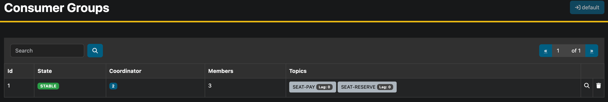
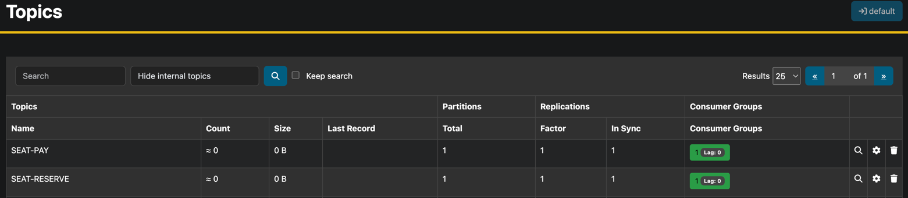

# 부하 테스트

## 대상 선정

#### 1. 가장 조회가 많이 일어나는 콘서트 일정 조회 (캐시 부하 테스트)

- 잦은 조회를 처리할 때, 부하 측정

#### 2. 대기열 진입 후 상태 조회(Polling) 시 부하

- 대기열을 몇명까지 처리할 수 있는지 테스트

## 환경

> MacOS (M3) 기준으로 작성  
> 부하 테스트를 진행하며, 임의의 목표치에 대한 환경을 찾을 수 있도록  
> 낮은 수준의 환경부터 구성

### JVM 옵션

-Xms512m -Xmx1024m : 최소 512의 힙크기, 최대 1GB의 힙 크기
-XX:ActiveProcessorCount=2 : CPU 사용량 조절, 2개의 코어만 사용

### 스프링 옵션

```yaml
spring:
  task:
    execution:
      pool:
        core-size: 2 # 스레드 갯수
        max-size: 10 # 최대 스레드 갯수
        queue-capacity: 50 # 요쳥 대기열 사이즈
```

## 시나리오

1. 많은 유저들이 특정 콘서트를 예약하기 위해 콘서트 목록과 일정을 조회
2. 특정 일정에 많은 유저들이 예약을 요청
3. **이후 조회와 대기열의 부하를 각각 측정**

> 이후 아래와 같이 도커로 다시 로컬 그라파나/카프카를 다시 올려서  
> 초기화된 상태로 이벤트의 렉도 모니터링 및 로그 확인
> 
> 

---

## 테스트 실행 (K6)

1. 10초 동안 100명

```
checks.........................: 96.61% 285 out of 295
data_received..................: 605 MB 16 MB/s
data_sent......................: 18 kB  490 B/s
http_req_blocked...............: avg=1.6ms    min=2µs     med=1.37ms max=4.99ms   p(90)=3.58ms   p(95)=3.7ms   
http_req_connecting............: avg=955.24µs min=0s      med=561µs  max=2.42ms   p(90)=2.27ms   p(95)=2.3ms   
http_req_duration..............: avg=16.66s   min=58.14ms med=18.51s max=36.35s   p(90)=29.03s   p(95)=31.41s  
  { expected_response:true }...: avg=16.24s   min=58.14ms med=14.75s max=32.71s   p(90)=28.53s   p(95)=30.75s  
http_req_failed................: 2.56%  5 out of 195
http_req_receiving.............: avg=101.39ms min=37µs    med=7.54ms max=710.17ms p(90)=402.42ms p(95)=537.94ms
http_req_sending...............: avg=84µs     min=5µs     med=44µs   max=1.85ms   p(90)=162.8µs  p(95)=261.39µs
http_req_tls_handshaking.......: avg=0s       min=0s      med=0s     max=0s       p(90)=0s       p(95)=0s      
http_req_waiting...............: avg=16.56s   min=57.3ms  med=18.51s max=36.33s   p(90)=29.03s   p(95)=31.41s  
http_reqs......................: 195    5.21809/s
iteration_duration.............: avg=34.58s   min=12.5s   med=34.88s max=37.36s   p(90)=35.87s   p(95)=36.02s  
iterations.....................: 100    2.675943/s
successful_requests............: 190    5.084292/s
vus............................: 1      min=1          max=100
vus_max........................: 100    min=100        max=100
```

그라파나는 무슨 10초에 100명도 못받고 타임아웃이 나고 있는데 김칫국도 물도 못마시겠다.  
모든 성능 제한 옵션을 풀어도 결과는 비슷했다.    
긴 시간의 삽질끝에 ```jpa.hibernate.show-sql``` 옵션을 없애니 엄청 빨라졌다.  
콘솔에 로그를 출력하는 I/O 자체가 서버의 부하를 엄청 주는일인 것 같다.  

또한 조금만 가상유저 수를 늘려도(15초에 200명)  
실행탭의 로그를 보여주는 속도가 너무 많고 빠른건지 IDE도 멈춰버리고  
노트북의 CPU 사용량도 99.9퍼센트를 찍어버렸다.

2. 5초 동안 100명 (콘솔에 로그 출력X)

```
checks.........................: 100.00% 300 out of 300
data_received..................: 637 MB  33 MB/s
data_sent......................: 19 kB   971 B/s
http_req_blocked...............: avg=1.33ms   min=5µs     med=751µs   max=3.45ms   p(90)=3.11ms   p(95)=3.17ms  
http_req_connecting............: avg=283.16µs min=0s      med=21µs    max=1.19ms   p(90)=818.09µs p(95)=868.55µs
http_req_duration..............: avg=7.53s    min=12.39ms med=7.65s   max=17.08s   p(90)=12.96s   p(95)=14.7s   
  { expected_response:true }...: avg=7.53s    min=12.39ms med=7.65s   max=17.08s   p(90)=12.96s   p(95)=14.7s   
http_req_failed................: 0.00%   0 out of 200
http_req_receiving.............: avg=48.96ms  min=24µs    med=11.12ms max=633.83ms p(90)=143.41ms p(95)=196.59ms
http_req_sending...............: avg=173.8µs  min=6µs     med=71µs    max=1.27ms   p(90)=365.3µs  p(95)=568.94µs
http_req_tls_handshaking.......: avg=0s       min=0s      med=0s      max=0s       p(90)=0s       p(95)=0s      
http_req_waiting...............: avg=7.48s    min=12.28ms med=7.65s   max=17.03s   p(90)=12.95s   p(95)=14.64s  
http_reqs......................: 200     10.330533/s
iteration_duration.............: avg=17.17s   min=11.1s   med=17.15s  max=19.35s   p(90)=17.95s   p(95)=17.97s  
iterations.....................: 100     5.165267/s
successful_requests............: 200     10.330533/s
vus............................: 1       min=1          max=100
vus_max........................: 100     min=100        max=100
```

모든 요청을 처리했고  
P95가 196ms 인 나쁘지 않은 성능을 보였다.

3. 1초에 1000명

```
checks.........................: 13.27% 326 out of 2456
data_received..................: 1.0 GB 26 MB/s
data_sent......................: 173 kB 4.3 kB/s
http_req_blocked...............: avg=21.97ms  min=0s      med=12.15ms max=202.73ms p(90)=99.86ms  p(95)=100.79ms
http_req_connecting............: avg=21.6ms   min=0s      med=11.83ms max=202.72ms p(90)=99.84ms  p(95)=100.77ms
http_req_duration..............: avg=4.37s    min=0s      med=12.3ms  max=39.63s   p(90)=22.93s   p(95)=31.8s   
  { expected_response:true }...: avg=19.45s   min=4.75s   med=18.14s  max=39.63s   p(90)=35.74s   p(95)=37.76s  
http_req_failed................: 86.72% 1065 out of 1228
http_req_receiving.............: avg=29.93ms  min=0s      med=0s      max=822.2ms  p(90)=55.12ms  p(95)=207.36ms
http_req_sending...............: avg=302.31µs min=0s      med=25µs    max=5.62ms   p(90)=840.3µs  p(95)=1.49ms  
http_req_tls_handshaking.......: avg=0s       min=0s      med=0s      max=0s       p(90)=0s       p(95)=0s      
http_req_waiting...............: avg=4.34s    min=0s      med=12.2ms  max=39.57s   p(90)=22.9s    p(95)=31.76s  
http_reqs......................: 1228   30.642418/s
iteration_duration.............: avg=2.18s    min=12.42ms med=71.17ms max=36.11s   p(90)=103.46ms p(95)=32.7s   
iterations.....................: 1065   26.575061/s
successful_requests............: 163    4.067357/s
vus............................: 931    min=931          max=1000
vus_max........................: 1000   min=1000         max=1000
```

초당 1000명의 요청은 대부분 실패한다.  
사실 ```콘서트 목록 조회``` 후 ```특정 콘서트의 일정 목록 조회``` 를 테스트했기에  
초당 2000개의 트랜젝션을 처리하는 과정이라고 볼 수 있고  
```CannotCreateTransactionException``` 과 Broken Pipe Error 등이 발생했다.

커넥션풀이 부족하기에 캐시처리를 해야됐는데  
현재 프로젝트에서는 **좌석조회**만 레디스를 이용한 캐시처리가 되어있다.

_첫 캐시 적용 전략이 잘못되었다._

사용자의 입장에서 고려해보면 당연히 가장 수요가 많고 접근성이 좋은 데이터부터 캐시처리를 했어야했다.

이후 콘서트관련 데이터를 임시로 캐시처리 후 다시 측정해 보았다.

4. 1초에 1000명 (임시로 레디스(```opsForValue```) 적용)

```
✗ GET /concerts: 상태코드 200
  ↳  97% — ✓ 2500 / ✗ 68
✗ GET /concerts: 응답이 배열
  ↳  97% — ✓ 2500 / ✗ 68
✓ GET /concerts/{concertId}: 상태코드 200
✓ GET /concerts/{concertId}: 응답이 배열

checks.........................: 91.44% 7500 out of 8202
data_received..................: 989 kB 94 kB/s
data_sent......................: 488 kB 46 kB/s
http_req_blocked...............: avg=2.42ms   min=0s     med=3µs     max=136.07ms p(90)=161µs    p(95)=5.77ms  
http_req_connecting............: avg=2.15ms   min=0s     med=0s      max=124.18ms p(90)=130µs    p(95)=3.49ms  
http_req_duration..............: avg=37.29ms  min=0s     med=10.08ms max=399.32ms p(90)=106.42ms p(95)=181.68ms
  { expected_response:true }...: avg=39.74ms  min=145µs  med=11.22ms max=399.32ms p(90)=119.31ms p(95)=185.97ms
http_req_failed................: 6.55%  351 out of 5351
http_req_receiving.............: avg=874.51µs min=0s     med=46µs    max=80.49ms  p(90)=215µs    p(95)=611.99µs
http_req_sending...............: avg=150.72µs min=0s     med=7µs     max=13.56ms  p(90)=107µs    p(95)=403µs   
http_req_tls_handshaking.......: avg=0s       min=0s     med=0s      max=0s       p(90)=0s       p(95)=0s      
http_req_waiting...............: avg=36.26ms  min=0s     med=9.68ms  max=395.52ms p(90)=106.01ms p(95)=181.23ms
http_reqs......................: 5351   505.974011/s
iteration_duration.............: avg=1.83s    min=5.98ms med=2.03s   max=2.47s    p(90)=2.24s    p(95)=2.43s   
iterations.....................: 2851   269.581743/s
successful_requests............: 5000   472.784536/s
vus............................: 1000    min=1000          max=1000
vus_max........................: 1000    min=1000          max=1000
```

캐시적용 및 노트북 재부팅 이 후 100%의 응답 성공률은 아니지만 확실히 많이 개선되었다.

일부 요청에 대해 ```ERR max number of clients reached``` 등의 에러 로그를 확인 할 수 있었지만  
캐시의 성능에 대해 체감할 수 있었다.