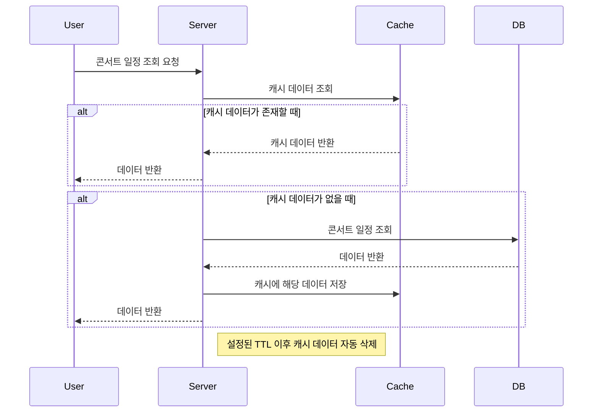
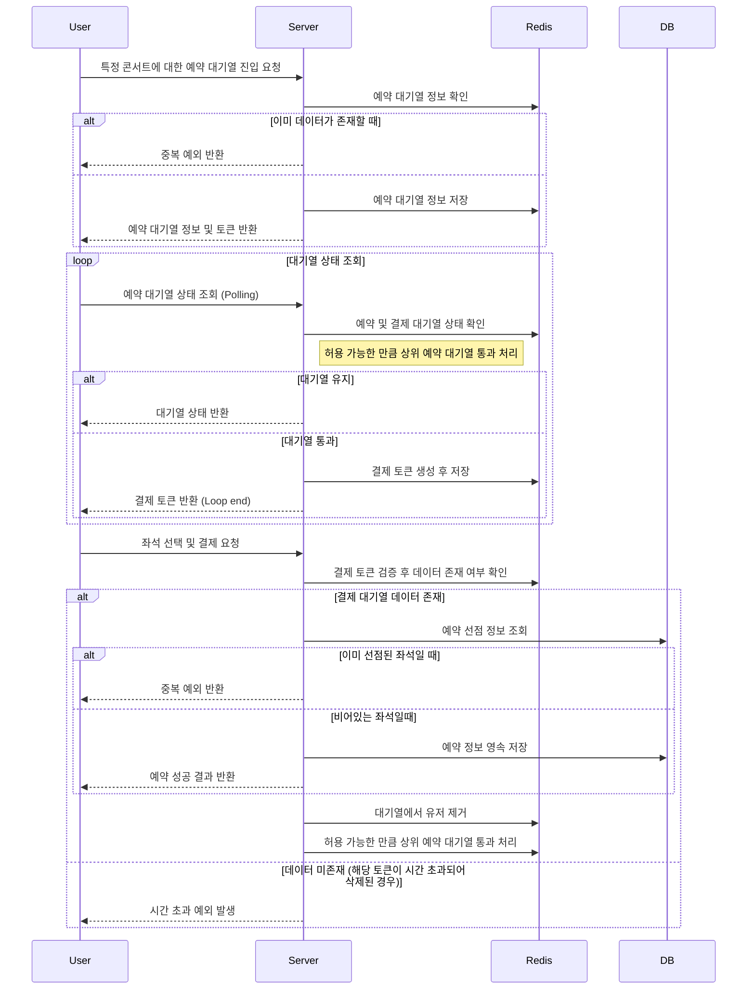

# STEP13

### 목차

- [성능 문제 파악](#1-조회-성능에-대한-문제-파악)
- [이관 가능 로직](#2-redis-로-이관-가능한-로직)
- [Flowchart](#3-flowchart)

---

## 1. 조회 성능에 대한 문제 파악

### 1-1. 대기열

> 유저가 대기열에 진입하려면 필수적으로 대기열 상태를 조회해야한다.  
> 하지만 현재 분산락을 사용함으로써 결국 일정한 간격으로   
> **대기열에 새로 들어오는 유저수 만큼의 대기열 저장 쿼리를 요청하게 된다.**

### 1-2. 좌석 조회

> 유저가 대기열 이후 좌석 예약을 위해 예약 가능한 좌석 목록을 조회한다.    
> 한명의 유저는 좌석 엔티티에 대해 최소 3번의 트랜잭션을 요청해야만 한다.  
> ```(조회, 선점, 결제 후 예약 확정)```
>
> 하지만 이 경우, 대기열 이후 정해진 인원에 한해서만 요청하기 때문에  
> **과도한 트래픽이 발생할 가능성이 적으므로 기하급수적으로 부하가 발생할 가능성이 적다**

### 1-3. 콘서트 일정 조회

> 특정 콘서트의 일정의 좌석 예약 대기열에 진입하기 전에  
> **예약을 시도하는 모든 유저가 해당 콘서트의 일정을 조회한다.**
>
> 현재 사용중인 MySQL 버전은 8.4 이며 MySQL 에 대한 해당 내용을 찾아본 결과   
> _**MySQL 8.x버전 이후로 DB 레벨의 쿼리 캐시 기능은 완전히 삭제되었다.**_  
> [참고](https://medium.com/@wjdrnr6662/mysql-query-cache%EB%8A%94-%EC%99%9C-%EC%82%AC%EC%9A%A9%EB%90%98%EC%A7%80-%EC%95%8A%EC%9D%84%EA%B9%8C-55e44991b301)
>
> 즉, **콘서트 별 일정 조회가 가장 부하가 크다고 할 수 있다.**

---

## 2. Redis 를 이용한 캐싱

### 2-1. 기본적인 캐싱 전략

> 기본적으로 데이터를 캐싱함으로써 데이터베이스에 대한 직접적인 접근을 줄인다.  
> 이를 위해 자주 조회되지만 변경 빈도가 낮은 데이터를 우선적으로 캐싱하여 응답속도를 높일 수 있다.

### 2-2. 이관 시 서버의 캐싱 I/O 전략

> Application Level
> 1. 스프링의 경우 ```AOP```를 활용한다.  
     클래스나 메소드 단위로 캐시를 설정(```@Cacheable```,```@CacheEvict```)한다.
> 2. 조회 시 캐시데이터가 존재한다면, 데이터베이스에서 조회하는것이 아닌 해당 캐시 데이터를 반환한다.
> 3. 변경 시 기존의 캐시 데이터를 날려버리고 조회한 데이터베이스의 데이터를 새로운 캐시 데이터를 설정한다.
> 4. 데이터베이스에서 조회한 데이터를 반환한다.

- External Level (Redis)
  1. 캐시 대상의 데이터를 위한 유일한 키를 생성한다. ```키 - 1:1 - 데이터```
  2. 해당 데이터에 유즈케이스에 맞는 ```TTL```을 설정해서 불필요한 자원 점유를 고려한다.
  3. 해당 데이터에 알맞은 자료구조 형태로 저장한다.
  4. 이후 해당 키에 대한 요청 시, 데이터가 존재한다면 반환한다.

### 2-3. 성능측면의 기대효과

#### In-Memory 구조의 빠른 반환

> 사용자는 데이터베이스를 사용하는 것보다 비교적 빠르게 응답을 받아볼 수 있다.

#### 데이터베이스의 부하 감소

> 비용이 높은 데이터베이스의 부하가 감소함으로써 다른 트랜잭션의 처리 속도를 향상시킨다.

### 2-4. 콘서트 일정 조회의 캐시 구현

1. 콘서트별 일정 정보에 대해서 키를 만든다.  
   ```e.g. scheduleCacheKey = "{concertId}:{scheduleId}"```
2. 해당 스케줄 데이터를 저장할 알마은 자료구조를 채택한다.  
   일정 정보에는 시간 등 세분화된 데이터가 존재함으로 ```Hash``` 가 좋다고 판단된다.  
   ```e.g. HSET {concertId}:{scheduleId} stt_time 2024.12.12-18:30 end_time 2024.12.12-23:30 ...```
3. ```TTL```을 설정한다. 해당 일정 이후 해당 데이터를 조회하는 경우가 적어질 것이라 판단됨으로  
   **예약가능 시간, 또는 콘서트 종료 시간에서 현재시간을 뺀 만큼 TTL을 적용한다.**

---

## 3. <span style="color:#FFA500">(중요)</span> Redis 로 대기열 로직 이관

> 대기열은 기본적으로 사용자가 몰리는 경우 발생한다.  
> 이 때, 클라이언트가 ```HTTP Polling``` 등으로 대기열의 상태를 주기적으로 조회한다면   
> 데이터베이스에 심한 부하가 걸리게 된다.

### 3-1. 대기열 구현에 필요한 데이터 목록

좌석 예약 대기열을 구현하기 위한 데이터는 다음과 같다.

- 일정의 아이디
- 유저의 아이디
- 대기열 입장 시간

데이터의 종류를 봤을때, 레디스의 ```Sorted Set```을 활용하는것이 적당하다.  
```Sorted Set```은 ```Key```,```Member```, ```Score``` 로 이루어진 자료구조이다.  
```ZSET```이라고도 불리며 ```Key```를 기준으로 (```Member```, ```Score```) 가 Pair하게 저장되며  
```Score```로 자동정렬되는 리스트와 유사한 구조이다.

이 자료구조를 활용해서

- ```Key``` : 일정의 아이디
- ```Member``` : 유저의 아이디
- ```Score``` : 대기열 입장 시간의 UnixTime

이러한 형태로 활용이 가능하다.

### 3-2. 대기열 스케줄러 기능 이관 가능 여부

#### ```TTL``` 로 수정하면 기존의 스케줄러를 대체할 수 있을까?

> 위 대기열 구현의 ```Sorted Set``` 자료구조와  
> **콘서트 일정 조회의 캐시 구현** 방법을 응용하면  
> 기존의 스케줄러 기능도 이관이 가능하며
> 이로써 서버의 로직을 보다 단순하고 직관적이게 수정이 가능하다.

기존의 일정한 주기로 시간 초과 여부를 판단하여 데이터베이스에서 직접 삭제했다면,  
이젠 TTL을 이용해서 해당 로직 자체를 자료구조만으로 대체할 수 있다.

스케줄러로 구현되는 로직은 다음과 같다.

1. 일정 주기로 데이터베이스에서 대기열을 통과한 유저 정보 조회
2. 해당 유저 정보 중 좌석 결제 시간 초과 여부 판단
3. 시간 초과 시 데이터베이스에 삭제 쿼리 전송

위 로직을 레디스의 기능을 이용해서  
**실시간에 가까운 결제 대기열 관리를 할 수 있다.**

1. ```notify-keyspace-events``` 옵션 활성화로 키 제거 시 이벤트 발행
2. 대기열 통과 시 좌석 결제 가능 시간을 TTL로 설정
3. TTL 시간 이후 이벤트 리스너에서 대기열의 최상위 유저를 PASS

---

## 4. Flowchart

### Caching



### 대기열

